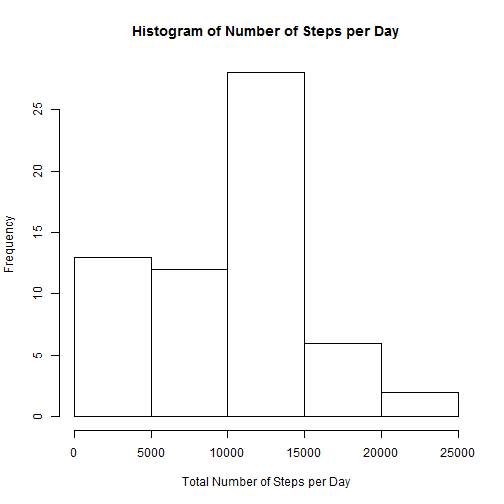
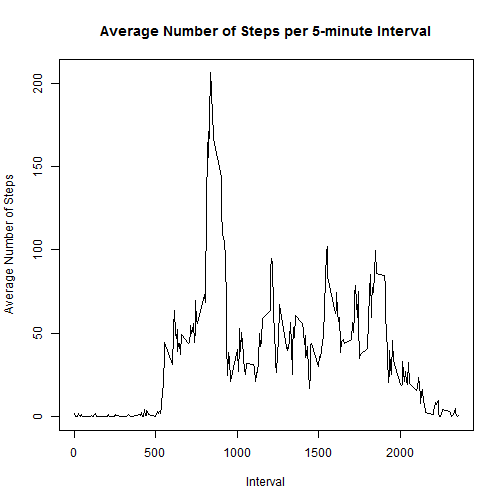
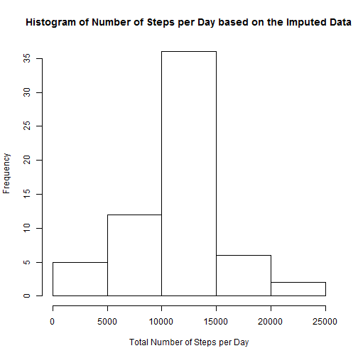
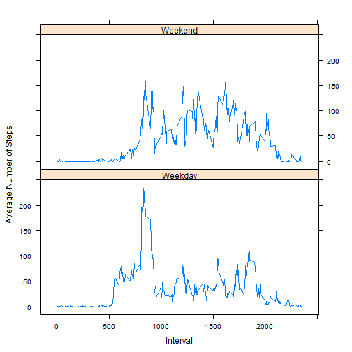

Load the libraries neccesary for this report.

```r
library(lattice)
library(dplyr)
```


## Loading and preprocessing the data

Unzip and load the data.


```r
unzip("./activity.zip")
activity <- read.csv("./activity.csv")
```

Convert date to Date format.


```r
activity$date <- as.Date(activity$date, "%Y-%m-%d")
```

## What is mean total number of steps taken per day?

Calculate the number of steps per day.


```r
by_day <- group_by(activity, date)
steps_per_day <- summarise(by_day, total_steps = sum(steps, na.rm = TRUE))
```

Make a histogram of the number of steps taken per day.


```r
with(steps_per_day, hist(total_steps, xlab = "Total Number of Steps per Day", main = "Histogram of Number of Steps per Day"))
```

 

Calculate the mean and median.


```r
mean_per_day <- mean(steps_per_day$total_steps)
median_per_day <- median(steps_per_day$total_steps)
```

The total number of steps per day has a **mean** of **9354.2295082** and a **median** of **10395**.


## What is the average daily activity pattern?

Calculate the average number of steps per 5-minute interval.


```r
by_interval <- group_by(activity, interval)
average_per_interval <- summarise(by_interval, average_steps = mean(steps, na.rm = TRUE))
```

Make a time series plot of the 5-minute interval averages.


```r
with(average_per_interval, plot(interval, average_steps, type = "l", ylab = "Average Number of Steps", xlab = "Interval", main = "Average Number of Steps per 5-minute Interval"))
```

 

Calculate the 5-minute interval which has the highest number of steps on average.


```r
max_interval <- average_per_interval[which.max(average_per_interval$average_steps),]$interval
```

The **5-minute interval** with the *maximum number of steps* on average across all the days is interval **835**.

## Imputing missing values

The missing values in the data frame will be subsituted by the mean of the 5-minute interval over all days, as caluclated in the previous step.


```r
activity_imputed <- transform(activity, steps = ifelse(is.na(steps), average_per_interval[average_per_interval$interval == interval]$average_steps, steps))
```

Create a historgram for the total number of steps taken each day. 


```r
by_day_imputed <- group_by(activity_imputed, date)
steps_per_day_imputed <- summarise(by_day_imputed, total_steps = sum(steps))
with(steps_per_day_imputed, hist(total_steps, xlab = "Total Number of Steps per Day", main = "Histogram of Number of Steps per Day based on the Imputed Data"))
```

 

Calculate the mean and median of the total number of steps taken per day. What are the differences?


```r
mean_per_day_imputed <- mean(steps_per_day_imputed$total_steps)
median_per_day_imputed <- median(steps_per_day_imputed$total_steps)
```

 Value  | With NA's | Imputed 
 ------ | ---: | ---: 
 Mean   | 9354.23 | 10766.19 
 Median | 10395 | 10766.19 


Both the *mean* and the *median* of the imputed data are **higher**. 
Imputing the NA's will **increase** the total number of steps taken and therefore the mean and the median are higher.

## Are there differences in activity patterns between weekdays and weekends?

Create a new factor variable in the dataset with two levels: Weekday and Weekend.


```r
activiy_daytype <- transform(activity, daytype = ifelse(weekdays(date) %in% c("zaterdag","zondag"), "Weekend","Weekday"))
```

Calculate the averages per daytype.


```r
by_interval_daytype <- group_by(activiy_daytype, interval, daytype)
average_per_interval_daytype <- summarise(by_interval_daytype, average_steps = mean(steps, na.rm = TRUE))
```

Make a panel plot containing a time series of the 5-minute interval and the average number of steps taken, averaged across all weekday days or weekend days.


```r
xyplot(average_steps ~ interval | daytype, data = average_per_interval_daytype, type = "l", layout = c(1,2), xlab = "Interval", ylab = "Average Number of Steps")
```

 


